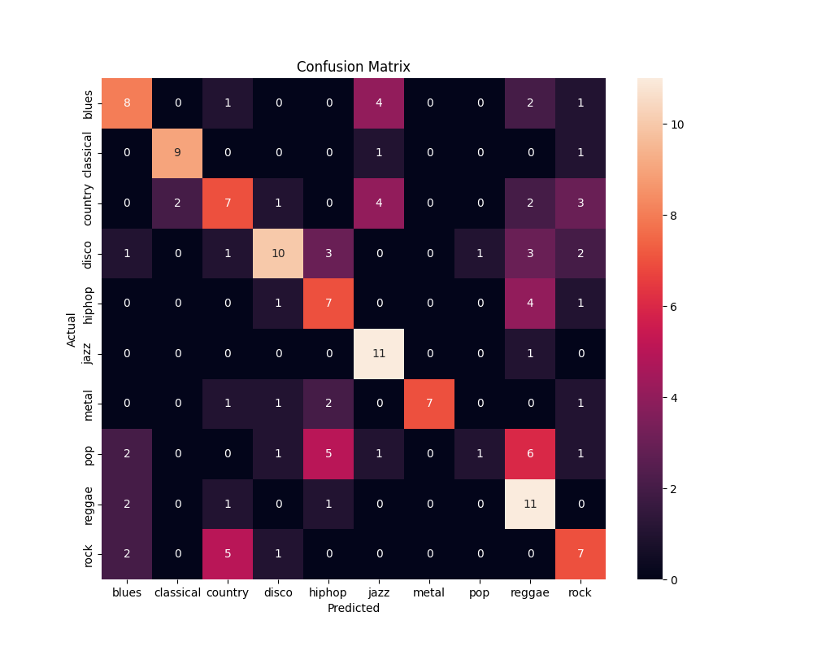
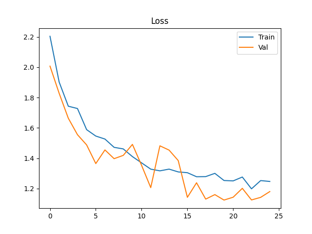
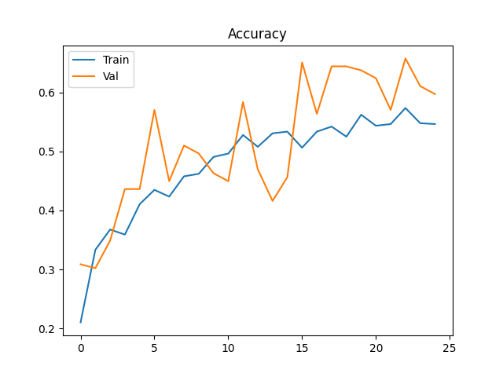

# 🎧 Music Genre Classification (CNN + Audio Processing)

This project demonstrates an end-to-end machine learning workflow for audio classification by developing a Convolutional Neural Network (CNN) to classify music genres from raw audio. Trained on the GTZAN dataset and benchmarked against a Logistic Regression baseline, the project covers data preprocessing, model development, and performance evaluation.

## 📌 Project Overview
Music genre classification is a classic problem in audio signal processing and machine learning. This project demonstrates how to:

    - Convert raw audio into Mel spectrograms
    - Train a CNN on audio features
    - Evaluate performance using classification metrics
    - Compare deep learning vs traditional machine learning
    
The model is trained on the GTZAN dataset, which contains 10 music genres with 100 audio samples each.
    
## 🧠 Models Used
### 🔹 Convolutional Neural Network (Primary Model)
    - 3 convolutional layers with batch normalization
    - Max pooling for feature extraction
    - Global average pooling
    - Fully connected classifier with dropout
The model leverages spatial feature extraction from Mel spectrograms, treating them as 2D images.

### 🔹 Logistic Regression (Baseline)
    - Trained on flattened spectrogram features
    - Provides a performance benchmark

## 📊 Results
| Model                 | Test Accuracy |
|-----------------------|--------------|
| CNN (Primary Model)   | **51.66%**   |
| Logistic Regression   | 41.06%       |

## 🔍 Analysis & Insights
- The CNN performed best on genres with **distinct spectral patterns**, such as:
  - Classical (F1: 0.82)
  - Metal (F1: 0.74)
  - Jazz (F1: 0.67)

- Performance was weakest on:
  - Pop (F1: 0.11), indicating difficulty distinguishing it from similar genres
  - Country and rock, which show moderate confusion with overlapping classes

- The model achieved high recall for **jazz (0.92)** and **reggae (0.73)**, suggesting strong ability to detect certain genre-specific frequency patterns.

- The confusion matrix indicates that errors are not random, but occur between **acoustically similar genres**, such as:
  - Rock vs metal
  - Pop vs disco

- The CNN improves performance by ~10 percentage points over Logistic Regression, showing the importance of **spatial feature extraction in spectrograms**.

- The gap between validation accuracy (65.77%) and test accuracy (51.66%) suggests moderate overfitting:
  - The model performs well on validation data seen during training
  - Performance drops on the unseen test set
  - This indicates the learned patterns do not fully generalize beyond the training distribution
    
## 📈 Visualizations
### Confusion Matrix

### Training Loss

### Accuracy Curve


## ⚙️ Tech Stack
- Python
- PyTorch
- Torchaudio
- Librosa
- Scikit-learn
- Matplotlib / Seaborn

## ▶️ How to Run

```bash
python train.py
python evaluate.py
python baseline.py
```

## 🔁 Reproducibility
All experiments are reproducible using a fixed random seed for dataset splitting and model training.
